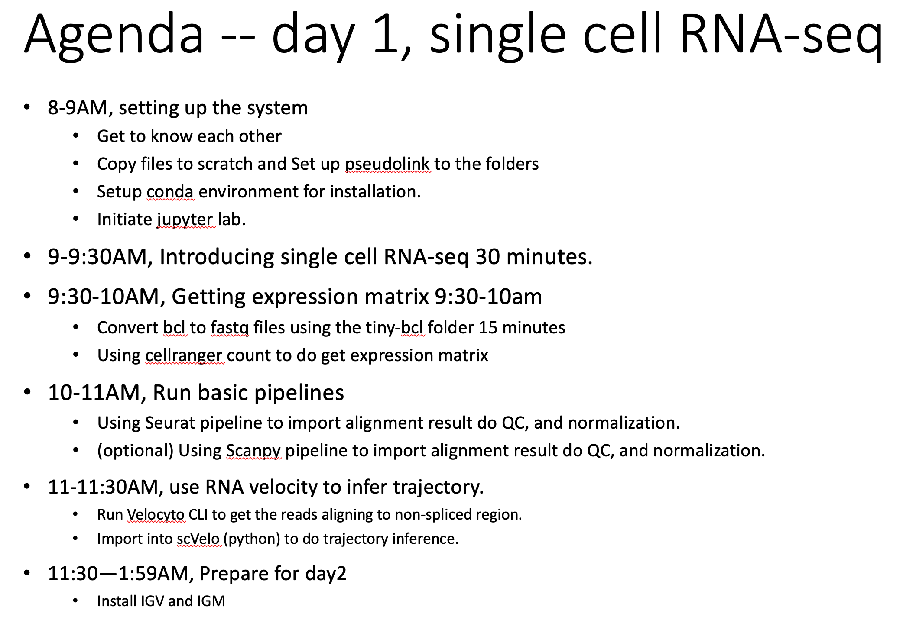
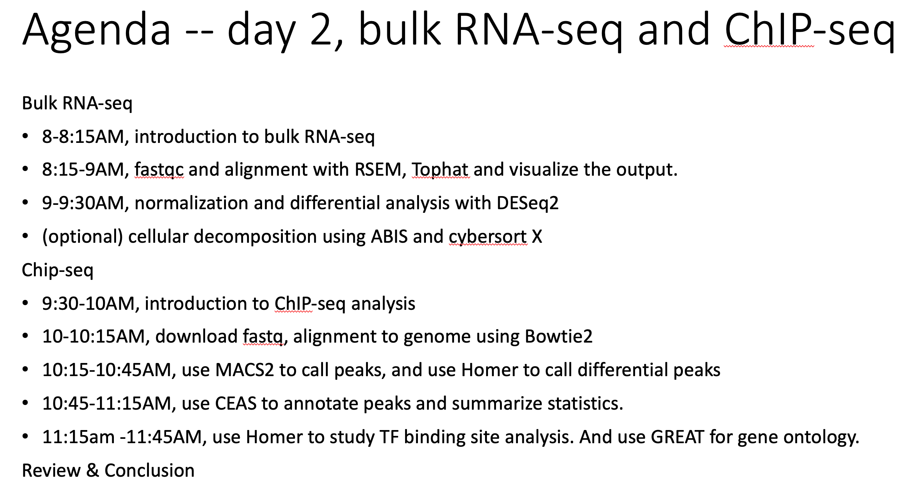

# NIEHS_NGS_Workshop <br>
This is 2-day (4hr each day) workshop on NGS data analysis.<br> 
We will use biowulf HPC as the computation evironment, and use jupyter lab as a interface  <br>

--This repository is for illustration only. Data files are included on biowulf folders for use in the class.--<br>

Target audience: NIEHS researchers who want to learn NGS data analysis.

Aims: to provide an overview of NGS analysis workflow for scRNA-seq, bulk RNA-seq and ChIP-seq. <br>
Prerequisite: confortable with shell scripts, R and python codes.  

Agenda of workshop, 

The README.md contains information to set up the workplace. <br>

Briefly,

On the 1st day, I will start from NGS_Workshop_Day1.pdf from the resources folder, do a ~30mins presentation.<br>
This will help setting up the working environment and get background knowledge on single-cell RNA-seq. <br>
The presentation will be followed by practical exercises in the scRNA-seq/notebooks folder.<br>
 
On the 2nd day, I will start from the NGS_Workshop_Day2.pdf file to do a presentation, which will be followed by exercise in the bulk-RNA and ChIP-seq folder. 


## This training will be divided into 3 parts. 

Bulk-RNA-seq <br>
Chip-seq<br>
Single cell RNA-seq <br> 

Each part will be given with a 15-30 minutes background introduction. 
then with hands-on practice/demo. 

To start with jupyter lab.

# We will use jupyter lab interface on Biowulf. (NIH)
## login into biowulf with ssh, initiate a detachable terminal through tmux, request a working node with sinteractive, and start to work with jupyter lab
> ssh -tX usr.name@biowulf.nih.gov <br>
```
module load tmux; tmux new
sinteractive --mem=50g --gres=lscratch:5 --tunnel 
### copy the code "ssh ..." to a new terminal and enter.
### come back to the tmux terminal with compute node, type --
module load jupyter
jupyter lab --ip localhost --port $PORT1 --no-browser 
### now copy the url to your web browser

### to install Python packages to python/3.7 kernel
> module load python/3.7
> pip install --user mypackage
```

This depository is setup for NIEHS training for RNA-seq.
We will use biowulf and use jupyter lab as an interface. 

Please log into your biowulf account, 
```
# establish pseudo links to our workshop folder. 
ln -s /spin1/users/classes/NIEHS_NGS/NIEHS_NGS_Workshop # class resources
ln -s /scratch/zhuy16/ scratch # temporary use, shared storage
cp -r NIEHS_NGS_Workshop scatch/workshop # a local copy for your own use

ln -s /data/user_id/ data # 100G quota
#git clone https://github.com/zhuy16/NIEHS_RNA_seq_training.git 
```
# The detailed plan of this workshop
<br>

<br>

