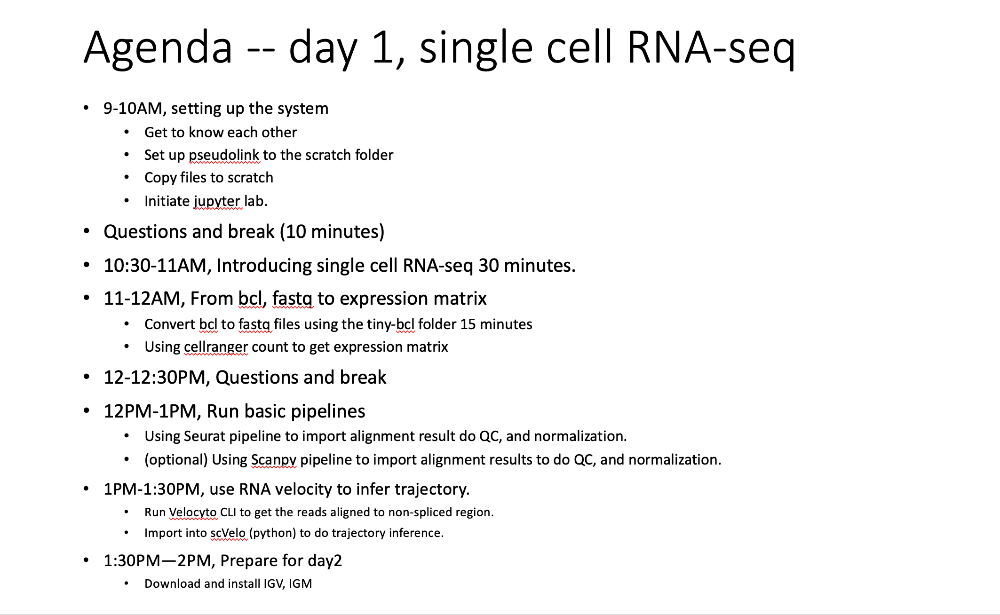
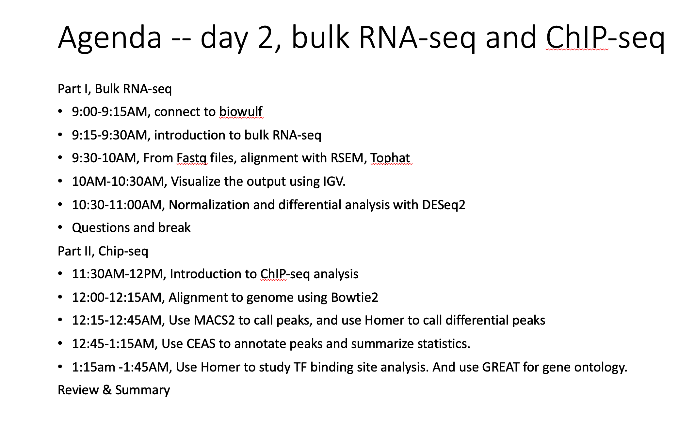

# NIEHS_NGS_Workshop (Currently Under Construction) 
* Target audience: NIEHS researchers who want to learn NGS data analysis.
* Aims: to provide an overview of NGS analysis workflow for scRNA-seq, bulk RNA-seq and ChIP-seq.  
* Prerequisite: confortable with shell scripts, R and python codes.  
* We will use biowulf HPC as the computation evironment, and use jupyter lab as a interface   
* This repository is for illustration only. Data files are included in biowulf folders for use in the class.** 
* The README.md contains information to set up the workplace.  

* This is 2-day (4hr each day) workshop on NGS data analysis.  
Briefly,  

   * On the 1st day, we will focus on single cell RNA-seq. I will start from NGS_Workshop_Day1.pdf from the resources folder, do a ~30mins presentation. 
This will help setting up the working environment and get background knowledge on single-cell RNA-seq.  
The presentation will be followed by practical exercises in the scRNA-seq/notebooks folder. 
 
   * On the 2nd day, we will discuss Bulk RNA-seq and ChIP-seq. I will start from the NGS_Workshop_Day2.pdf file to do a presentation, which will be followed by exercises in the bulk-RNA and ChIP-seq folder. 

* **We will use jupyter lab interface on Biowulf (an NIH HPC system), Please refer to [Getting_started.md](./Getting_started.md) to setup the working environment.**

# The detailed plan of this workshop
 

 

